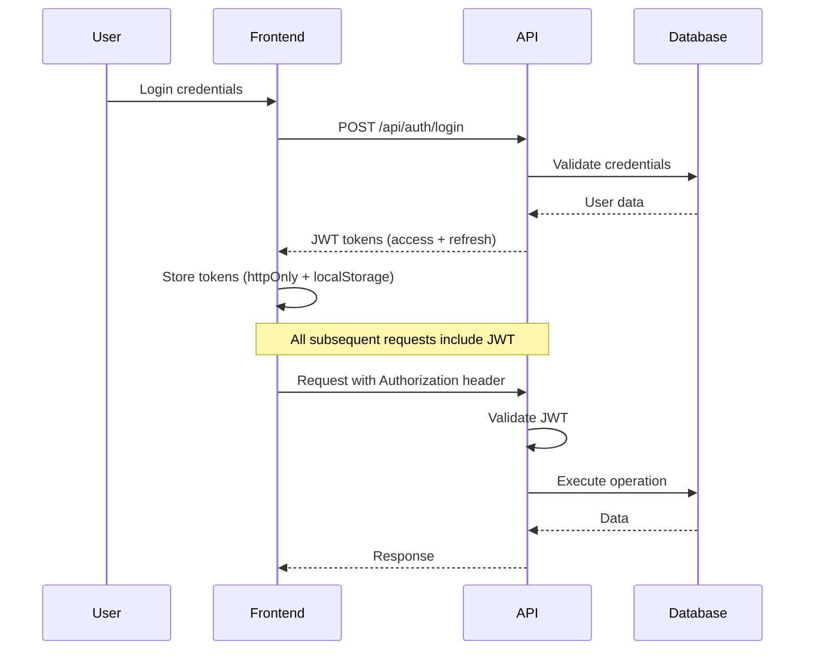
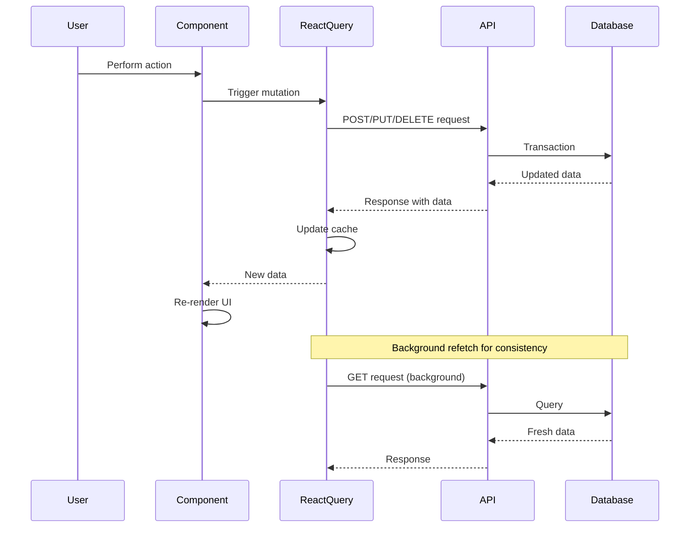
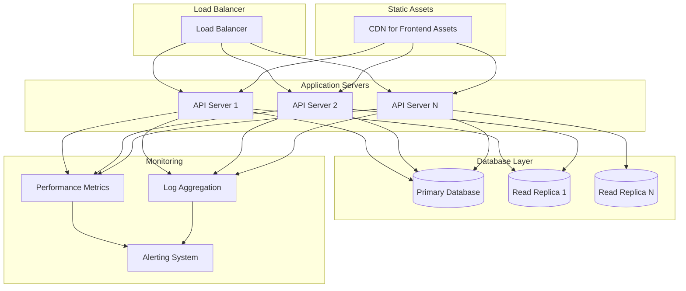

# Unit-Trek Inventory Management System - Architecture Documentation

## Table of Contents

1. [System Overview](#1-system-overview)
2. [C4 Model Architecture](#2-c4-model-architecture)
   - [Context Diagram](#21-context-diagram)
   - [Container Diagram](#22-container-diagram)
   - [Component Diagram](#23-component-diagram)
   - [Code Structure](#24-code-structure)
3. [System Architecture](#3-system-architecture)
   - [Frontend Architecture](#31-frontend-architecture)
   - [Backend Architecture](#32-backend-architecture)
   - [Database Architecture](#33-database-architecture)
4. [Data Architecture](#4-data-architecture)
5. [Security Architecture](#5-security-architecture)
6. [Quality Attributes](#6-quality-attributes)
7. [Architecture Decision Records (ADRs)](#7-architecture-decision-records-adrs)
8. [Deployment Architecture](#8-deployment-architecture)
9. [Evolution and Roadmap](#9-evolution-and-roadmap)

---

## 1. System Overview

### 1.1 System Purpose

Unit-Trek is a modern, web-based inventory management system designed to help businesses track and manage their stock across multiple warehouses. The system provides comprehensive functionality for item tracking, stock movements, audit trails, and analytics.

### 1.2 Key Features

- **Multi-Warehouse Management**: Manage inventory across multiple warehouse locations
- **Item Tracking**: Track items with barcodes, quantities, and minimum stock levels
- **Stock Movements**: Record incoming, outgoing, and adjustment movements
- **History & Analytics**: Complete audit trail and dashboard analytics
- **Barcode Scanning**: Single and batch barcode scanning support
- **User Management**: Role-based access control (Admin, Manager, User)
- **Internationalization**: Multi-language support (English, Arabic)
- **Dark Mode**: Beautiful UI with dark/light theme support
- **Import/Export**: Excel import and export functionality

### 1.3 Architectural Drivers

- **Scalability**: Support for multiple warehouses and growing inventory
- **Security**: Role-based access control and data protection
- **Performance**: Fast response times for inventory operations
- **Maintainability**: Clean, modular codebase with clear separation of concerns
- **Usability**: Intuitive interface with internationalization support
- **Reliability**: Consistent data management with audit trails

---

## 2. C4 Model Architecture

### 2.1 Context Diagram

```mermaid
graph TB
    subgraph "Business Context"
        Admin[Inventory Admin]
        Manager[Warehouse Manager]
        User[Regular User]
    end

    subgraph "External Systems"
        Barcode[Barcode Scanners<br/>Mobile Devices]
        Excel[Excel Files<br/>Import/Export]
        Email[Email System<br/>Notifications]
    end

    subgraph "Unit-Trek System"
        UT[Unit-Trek<br/>Inventory Management System]
    end

    %% User interactions
    Admin --> UT "Manages users, warehouses,<br/>views analytics"
    Manager --> UT "Manages inventory,<br/>approves movements"
    User --> UT "Records movements,<br/>views items"

    %% External system interactions
    Barcode --> UT "Scan barcodes"
    UT --> Excel "Import/Export data"
    UT --> Email "Send notifications"

    %% Styling
    classDef user fill:#e1f5fe
    classDef external fill:#f3e5f5
    classDef system fill:#e8f5e8

    class Admin,Manager,User user
    class Barcode,Excel,Email external
    class UT system
```

### 2.2 Container Diagram

```mermaid
graph TB
    subgraph "Frontend Layer"
        SPA[React SPA<br/>Single Page Application]
    end

    subgraph "Backend Layer"
        API[Express API<br/>RESTful Backend Service]
        Auth[JWT Authentication<br/>Token Management]
        Validation[Request Validation<br/>Zod Schemas]
    end

    subgraph "Data Layer"
        DB[(PostgreSQL/MySQL<br/>Database)]
        Files[File Storage<br/>Excel Uploads]
    end

    subgraph "External Services"
        EmailService[Email Service<br/>Notifications]
        Monitor[Error Monitoring<br/>Performance Tracking]
    end

    %% Connections
    SPA <--> API "HTTPS/REST API"
    API --> Auth "JWT Tokens"
    API --> Validation "Input Validation"
    API --> DB "SQL Queries"
    API --> Files "File Operations"
    API --> EmailService "SMTP/Email API"
    API --> Monitor "Error Logs"

    %% Data flow
    DB --> API "Data Returns"

    %% Styling
    classDef frontend fill:#e3f2fd
    classDef backend fill:#e8f5e8
    classDef data fill:#fff3e0
    classDef external fill:#fce4ec

    class SPA frontend
    class API,Auth,Validation backend
    class DB,Files data
    class EmailService,Monitor external
```

### 2.3 Component Diagram

```mermaid
graph TB
    subgraph "Frontend Components"
        subgraph "Page Layer"
            Dashboard[Dashboard Page]
            Inventory[Inventory Page]
            Movement[Movement Page]
            History[History Page]
        end

        subgraph "Component Layer"
            ItemTable[Item Table Component]
            MovementForm[Movement Form]
            BarcodeScanner[Barcode Scanner]
            Charts[Analytics Charts]
        end

        subgraph "Service Layer"
            ApiClient[API Client]
            AuthContext[Auth Context]
            Cache[React Query Cache]
        end
    end

    subgraph "Backend Components"
        subgraph "Route Handlers"
            AuthRoutes[/api/auth]
            ItemRoutes[/api/items]
            MovementRoutes[/api/movements]
            HistoryRoutes[/api/history]
        end

        subgraph "Business Logic"
            UserService[User Service]
            ItemService[Item Service]
            MovementService[Movement Service]
            ValidationService[Validation Service]
        end

        subgraph "Data Access"
            DatabaseAdapter[Database Adapter]
            Models[Data Models]
        end
    end

    subgraph "Database"
        Users[(users table)]
        Items[(items table)]
        Movements[(movements table)]
        History[(history table)]
    end

    %% Frontend connections
    Dashboard --> Charts
    Inventory --> ItemTable
    Movement --> MovementForm
    ItemTable --> BarcodeScanner

    Dashboard --> ApiClient
    Inventory --> ApiClient
    Movement --> ApiClient
    History --> ApiClient

    ApiClient --> AuthContext
    ApiClient --> Cache

    %% Backend connections
    AuthRoutes --> UserService
    ItemRoutes --> ItemService
    MovementRoutes --> MovementService
    HistoryRoutes --> ValidationService

    UserService --> DatabaseAdapter
    ItemService --> DatabaseAdapter
    MovementService --> DatabaseAdapter
    ValidationService --> DatabaseAdapter

    DatabaseAdapter --> Models
    Models --> Users
    Models --> Items
    Models --> Movements
    Models --> History

    %% Styling
    classDef frontendComp fill:#e3f2fd
    classDef backendComp fill:#e8f5e8
    classDef database fill:#fff3e0

    class Dashboard,Inventory,Movement,History,ItemTable,MovementForm,BarcodeScanner,Charts,ApiClient,AuthContext,Cache frontendComp
    class AuthRoutes,ItemRoutes,MovementRoutes,HistoryRoutes,UserService,ItemService,MovementService,ValidationService,DatabaseAdapter,Models backendComp
    class Users,Items,Movements,History database
```

### 2.4 Code Structure

```
unit-trek-main/
├── src/                          # Frontend source code
│   ├── components/               # Reusable React components
│   │   ├── ui/                  # shadcn/ui components
│   │   ├── forms/               # Form components
│   │   ├── tables/              # Table components
│   │   └── charts/              # Chart components
│   ├── pages/                   # Page components (routes)
│   ├── services/                # API services and utilities
│   │   ├── apiClient.ts         # Main API client
│   │   └── types.ts             # TypeScript types
│   ├── context/                 # React contexts
│   ├── hooks/                   # Custom React hooks
│   └── utils/                   # Utility functions
├── server/                       # Backend source code
│   ├── src/
│   │   ├── routes/              # API route handlers
│   │   ├── middleware/          # Express middleware
│   │   ├── config/              # Configuration files
│   │   ├── migrations/          # Database migrations
│   │   └── utils/               # Backend utilities
│   └── package.json
├── docs/                        # Documentation
└── tests/                       # Test files
```

---

## 3. System Architecture

### 3.1 Frontend Architecture

#### Technology Stack
- **React 18.3.1** with TypeScript
- **Vite 6.0.1** - Fast build tool and dev server
- **React Router 7.1.3** - Client-side routing
- **TanStack Query 5.83.0** - Server state management
- **Tailwind CSS 3.4.17** - Utility-first CSS framework
- **shadcn/ui** - Component library built on Radix UI
- **React Hook Form 7.54.2** - Form management with Zod validation
- **i18next** - Internationalization framework

#### Component Architecture

**Page Components (Route-based)**
- `Dashboard.tsx` - Main dashboard with analytics and KPIs
- `Inventory.tsx` - Item management interface
- `Movement.tsx` - Stock movement recording
- `History.tsx` - Audit trail viewing
- `Warehouses.tsx` - Warehouse management
- `Analytics.tsx` - Advanced analytics and reporting
- `BarcodeTools.tsx` - Barcode scanning and generation
- `Units.tsx` - Unit of measurement management

**State Management Strategy**
```typescript
// Context-based global state
- AuthContext: User authentication and session
- WarehouseContext: Multi-warehouse state
- InventoryContext: Item and movement state
- ThemeContext: Dark/light mode
- LocaleContext: Language switching (EN/AR)
- NotificationContext: Real-time notifications

// Server state management
- React Query: API data caching and synchronization
- Automatic refetching and optimistic updates
- Background data synchronization
```

**API Client Architecture**
```typescript
// Sophisticated API client with:
- JWT token management (access + refresh)
- Automatic token refresh with request queuing
- Rate limiting (30 req/min per endpoint)
- Retry logic with exponential backoff
- Input sanitization for security
- Performance monitoring
- Error handling and user-friendly messages
```

### 3.2 Backend Architecture

#### Technology Stack
- **Node.js** with Express 4.18.2
- **TypeScript** (migrating from JavaScript)
- **PostgreSQL** (primary) with MySQL support
- **JWT** for authentication
- **Zod 4.1.12** for runtime validation
- **Winston** for structured logging
- Security middleware: Helmet, CORS, express-rate-limit

#### Application Structure

**Express Middleware Stack**
```typescript
1. CORS (cross-origin requests)
2. Helmet (security headers with CSP)
3. Morgan (HTTP request logging)
4. Cookie Parser (httpOnly token support)
5. Express JSON/URL parser (10mb limit)
6. Rate Limiting (per-endpoint protection)
7. Authentication middleware (JWT verification)
8. Route handlers
9. Error handling middleware
10. 404 handler
```

**Security Implementation**
- Content Security Policy (CSP)
- HTTP Strict Transport Security (HSTS)
- Cross-Origin Resource Policy
- XSS Protection
- JWT with secure httpOnly cookies
- Rate limiting (different limits per endpoint type)
- Input validation and sanitization
- CORS configuration

### 3.3 Database Architecture

#### Multi-Database Support
The system supports both PostgreSQL and MySQL through a unified database adapter:

```javascript
// Database Abstraction Features:
- Unified query interface
- Automatic parameter conversion
- Connection pooling (PostgreSQL: 20, MySQL: 10)
- Transaction support
- Graceful connection handling
```

#### Database Schema

**Core Tables**
```sql
1. profiles - User management with UUID primary keys
2. user_roles - Role-based access control
3. warehouses - Multi-warehouse support
4. items - Inventory with barcode support
5. history_entries - Complete audit trail
6. units - Measurement units
7. unit_conversions - Unit conversion factors

Key features:
- UUID primary keys for all tables
- Foreign key constraints with CASCADE delete
- Comprehensive indexing for performance
- Timestamp tracking (created_at, updated_at)
- User tracking (created_by)
```

**Performance Indexes**
```sql
- idx_items_warehouse (warehouse_id)
- idx_items_barcode (barcode)
- idx_history_warehouse (warehouse_id)
- idx_history_item (item_id)
- idx_history_timestamp (timestamp)
- idx_profiles_user_id (user_id)
- idx_user_roles_user_id (user_id)
```

---

## 4. Data Architecture

### 4.1 Data Flow Patterns

#### Authentication Flow


#### Data Synchronization Flow


### 4.2 Data Models

#### User Management
```typescript
interface Profile {
  id: string;                    // UUID
  email: string;                 // User email
  full_name: string;             // Display name
  role: 'admin' | 'manager' | 'user';
  created_at: Date;
  updated_at: Date;
}

interface UserRole {
  user_id: string;               // Foreign key to profiles
  role: string;                  // Role name
  created_at: Date;
}
```

#### Inventory Management
```typescript
interface Warehouse {
  id: string;                    // UUID
  name: string;                  // Warehouse name
  location?: string;             // Physical location
  is_active: boolean;            // Active status
  created_by: string;            // Created by user
  created_at: Date;
  updated_at: Date;
}

interface Item {
  id: string;                    // UUID
  warehouse_id: string;          // Foreign key
  name: string;                  // Item name
  barcode?: string;              // Barcode (optional)
  quantity: number;              // Current quantity
  unit_id: string;               // Unit of measurement
  minimum_quantity: number;      // Minimum stock level
  notes?: string;                // Additional notes
  created_by: string;            // Created by user
  created_at: Date;
  updated_at: Date;
}
```

#### Movement Tracking
```typescript
interface HistoryEntry {
  id: string;                    // UUID
  warehouse_id: string;          // Foreign key
  item_id: string;               // Foreign key
  type: 'incoming' | 'outgoing' | 'adjustment';
  quantity: number;              // Movement quantity
  notes?: string;                // Movement notes
  created_by: string;            // Created by user
  created_at: Date;
}

interface Unit {
  id: string;                    // UUID
  name: string;                  // Unit name (e.g., "kg", "pcs")
  abbreviation: string;          // Short form
  created_at: Date;
}

interface UnitConversion {
  id: string;                    // UUID
  from_unit_id: string;          // Source unit
  to_unit_id: string;            // Target unit
  conversion_factor: number;     // Multiplier to convert from->to
  created_at: Date;
}
```

---

## 5. Security Architecture

### 5.1 Authentication & Authorization

#### JWT Token Strategy
```typescript
// Token configuration:
- Access Token: 15 minutes expiration
- Refresh Token: 7 days expiration
- Storage: httpOnly cookies + localStorage fallback
- Automatic refresh with request queuing
- Secure, HttpOnly, SameSite cookies
```

#### Role-Based Access Control (RBAC)
```typescript
// Role hierarchy:
1. Admin: Full system access
   - User management
   - Warehouse management
   - System configuration

2. Manager: Warehouse operations
   - Inventory management
   - Movement approval
   - Analytics access

3. User: Basic operations
   - Movement recording
   - Item viewing
   - History access
```

#### Permission Matrix
| Feature | Admin | Manager | User |
|---------|-------|---------|------|
| User Management | ✅ | ❌ | ❌ |
| Warehouse Management | ✅ | ❌ | ❌ |
| Create Items | ✅ | ✅ | ✅ |
| Edit Items | ✅ | ✅ | ❌ |
| Delete Items | ✅ | ✅ | ❌ |
| Record Movements | ✅ | ✅ | ✅ |
| View Analytics | ✅ | ✅ | ✅ |
| Import/Export | ✅ | ✅ | ❌ |

### 5.2 Security Measures

#### Input Validation & Sanitization
```javascript
// Multi-layer validation:
1. Frontend: React Hook Form + Zod validation
2. Backend: Zod schema validation
3. Database: Parameterized queries
4. Sanitization: XSS prevention
5. File uploads: Type and size restrictions
```

#### API Security
```javascript
// Security implementation:
- Rate limiting per endpoint type
  • Auth endpoints: 5 req/15min
  • Write endpoints: 50 req/15min
  • Read endpoints: 100 req/15min
- CORS configuration for allowed origins
- Request size limits (10mb)
- Error message sanitization
- SQL injection prevention
- XSS protection headers
```

#### Security Headers
```javascript
// Security headers via Helmet:
- Content Security Policy (CSP)
- HTTP Strict Transport Security (HSTS)
- Cross-Origin Resource Policy
- X-Frame-Options: DENY
- X-Content-Type-Options: nosniff
- Referrer-Policy: strict-origin-when-cross-origin
```

---

## 6. Quality Attributes

### 6.1 Performance

#### Frontend Performance
- **Bundle Size**: Optimized with manual chunk splitting
- **Code Splitting**: Route-based lazy loading
- **Caching**: React Query with 5-minute stale time
- **Rendering**: Optimized re-renders with proper dependency arrays
- **Images**: Optimized loading with placeholder states

#### Backend Performance
- **Database**: Connection pooling, indexed queries
- **Rate Limiting**: Prevents abuse and ensures stability
- **Validation**: Fast Zod schema validation
- **Logging**: Structured logging with Winston
- **Error Handling**: Graceful error recovery

#### Performance Metrics
```typescript
// Target performance:
- API Response Time: < 200ms (95th percentile)
- Page Load Time: < 2 seconds
- Database Query Time: < 100ms (average)
- Memory Usage: < 512MB (backend)
- Bundle Size: < 2MB (frontend)
```

### 6.2 Reliability

#### Error Handling Strategy
```typescript
// Multi-layer error handling:
1. Frontend: Error boundaries + toast notifications
2. API Client: Automatic retry with exponential backoff
3. Backend: Graceful error handling + structured logging
4. Database: Transaction rollback on errors
5. User Experience: Friendly error messages
```

#### Availability Considerations
- **Graceful Degradation**: Core functionality works without features
- **Offline Support**: Basic viewing capabilities (planned)
- **Data Integrity**: Foreign key constraints and validation
- **Backup Strategy**: Database backup procedures
- **Monitoring**: Error tracking and performance monitoring

### 6.3 Scalability

#### Horizontal Scaling
```typescript
// Scaling capabilities:
- Backend: Stateless design enables horizontal scaling
- Database: Read replicas and sharding support
- Frontend: CDN-friendly static assets
- API: Load balancer ready
```

#### Performance Optimization
```typescript
// Caching strategy:
- Frontend: React Query cache (5min stale, 10min cache)
- Database: Query result caching
- Static Assets: CDN distribution
- API Response: Compression and caching headers
```

### 6.4 Maintainability

#### Code Quality
- **TypeScript**: Type safety throughout the stack
- **Modular Design**: Clear separation of concerns
- **Documentation**: Comprehensive code comments
- **Testing**: Unit tests and E2E tests
- **Code Standards**: ESLint and Prettier configuration

#### Development Workflow
```typescript
// Development practices:
- Git flow for version control
- Automated testing on PR
- Code review process
- Continuous integration (planned)
- Feature flags for gradual rollout
```

---

## 7. Architecture Decision Records (ADRs)

### ADR-001: Multi-Database Support Strategy

**Status**: Accepted
**Date**: 2024-01-01
**Decision**: Support both PostgreSQL and MySQL through unified adapter

**Context**:
- Customer requirements vary for database preferences
- Need flexibility for deployment environments
- PostgreSQL preferred for production, MySQL for simplicity

**Decision**:
Create a database abstraction layer that provides a unified interface for both PostgreSQL and MySQL, with automatic parameter conversion and connection management.

**Consequences**:
✅ Flexibility for customers
✅ Easier development and testing
❌ Additional complexity in database layer
❌ Need to maintain compatibility with both databases

---

### ADR-002: Frontend Framework Selection

**Status**: Accepted
**Date**: 2024-01-01
**Decision**: Use React 18 with TypeScript and Vite

**Context**:
- Need modern, performant frontend framework
- TypeScript requirement for type safety
- Fast development experience needed

**Decision**:
React 18 with TypeScript, Vite for build tool, and comprehensive ecosystem including React Query, Tailwind CSS, and shadcn/ui components.

**Consequences**:
✅ Excellent performance with Vite
✅ Type safety with TypeScript
✅ Rich ecosystem and community support
✅ Modern development experience
❌ Learning curve for team members

---

### ADR-003: Authentication Strategy

**Status**: Accepted
**Date**: 2024-01-01
**Decision**: JWT with refresh tokens and httpOnly cookies

**Context**:
- Need secure, scalable authentication
- Support for session management
- Protection against CSRF and XSS

**Decision**:
Implement JWT authentication with short-lived access tokens (15min) and longer refresh tokens (7days), stored in httpOnly cookies with localStorage fallback.

**Consequences**:
✅ Secure token management
✅ Automatic token refresh
✅ Protection against common attacks
✅ Stateless authentication
❌ More complex than session-based auth
❌ Requires careful token management

---

### ADR-004: State Management Approach

**Status**: Accepted
**Date**: 2024-01-01
**Decision**: React Context for global state, React Query for server state

**Context**:
- Need efficient state management
- Server state synchronization required
- Component-level state management needed

**Decision**:
Use React Context for global application state (auth, theme, locale) and React Query for server state management with caching and synchronization.

**Consequences**:
✅ Separation of concerns
✅ Automatic cache management
✅ Optimistic updates support
✅ Background synchronization
❌ Learning curve for React Query
❌ More complex than simple state management

---

### ADR-005: API Design Pattern

**Status**: Accepted
**Date**: 2024-01-01
**Decision**: RESTful API with comprehensive validation

**Context**:
- Need clear, maintainable API design
- Input validation required
- Error handling consistency needed

**Decision**:
Implement RESTful API with Zod validation schemas, comprehensive error handling, and consistent response format with proper HTTP status codes.

**Consequences**:
✅ Clear API contract
✅ Type-safe validation
✅ Consistent error handling
✅ Easy to consume by frontend
❌ More boilerplate code
❌ Strict validation complexity

---

## 8. Deployment Architecture

### 8.1 Development Environment

```yaml
# Development setup
Frontend:
  - Vite dev server (port 8080)
  - Hot Module Replacement
  - TypeScript checking
  - ESLint integration

Backend:
  - Node.js server (port 3001)
  - Nodemon for auto-restart
  - Database connection pooling
  - Environment-based configuration

Database:
  - PostgreSQL or MySQL locally
  - Migration scripts
  - Seed data for development
```

### 8.2 Production Deployment

#### Build Process
```typescript
// Production build steps:
1. TypeScript compilation
2. Vite build optimization
3. Asset minification and bundling
4. Environment-specific configuration
5. Database migrations
6. Health check endpoints
7. Graceful shutdown handling
```

#### Deployment Architecture


### 8.3 Infrastructure Requirements

#### Minimum Requirements
```yaml
Frontend:
  - Node.js 18+
  - 2GB RAM
  - 10GB Storage

Backend:
  - Node.js 18+
  - 4GB RAM
  - 20GB Storage

Database:
  - PostgreSQL 12+ or MySQL 8+
  - 4GB RAM
  - 50GB Storage (SSD recommended)
```

#### Scaling Requirements
```yaml
Small Scale (< 100 users):
  - Single application server
  - Single database instance
  - Basic monitoring

Medium Scale (100-1000 users):
  - 2-3 application servers
  - Database with read replicas
  - CDN for static assets
  - Enhanced monitoring

Large Scale (> 1000 users):
  - Load balancer + multiple servers
  - Database clustering
  - Redis cache layer
  - Full observability stack
```

---

## 9. Evolution and Roadmap

### 9.1 Technical Debt

#### Current Technical Debt
1. **Backend Migration**: Partial migration from JavaScript to TypeScript
2. **Real-time Updates**: No WebSocket implementation (polling-based)
3. **File Management**: Limited file attachment support
4. **Testing Coverage**: Unit tests present but could be more comprehensive
5. **Documentation**: API documentation needs enhancement
6. **Monitoring**: Basic error tracking, could use APM tools

#### Migration Roadmap
```typescript
// Q1 2024:
- Complete backend TypeScript migration
- Enhance unit test coverage (> 80%)
- Implement comprehensive API documentation

// Q2 2024:
- WebSocket implementation for real-time updates
- Advanced monitoring and observability
- File attachment system

// Q3 2024:
- Performance optimization and caching
- Advanced analytics features
- Mobile app development

// Q4 2024:
- Microservices architecture exploration
- Machine learning integration for predictions
- Advanced reporting system
```

### 9.2 Future Enhancements

#### Planned Features
1. **Real-time Notifications**: WebSocket-based notifications
2. **Advanced Analytics**: Business intelligence and reporting
3. **Mobile Application**: React Native mobile app
4. **API V2**: GraphQL or enhanced REST API
5. **Multi-tenancy**: Support for multiple organizations
6. **Integration Platform**: Third-party system integrations

#### Architecture Evolution
```typescript
// Phase 1: Current (Monolithic)
- Single application server
- Integrated frontend and backend
- Basic monitoring

// Phase 2: Enhanced (Planned)
- Microservices architecture
- Event-driven communication
- Advanced caching layer
- Full observability

// Phase 3: Cloud Native (Future)
- Container orchestration (Kubernetes)
- Serverless functions
- Event sourcing
- Advanced security features
```

### 9.3 Technology Watch

#### Emerging Technologies
```typescript
// Monitoring potential adoption:
- Distributed tracing (Jaeger, Zipkin)
- Advanced APM (DataDog, New Relic)
- Chaos engineering tools
- Infrastructure as Code (Terraform, Pulumi)

// Frontend evolution:
- WebAssembly for performance-critical features
- Progressive Web App (PWA) capabilities
- Advanced state management solutions
- Edge computing integration

// Backend evolution:
- GraphQL for flexible API queries
- Event-driven architecture
- Serverless computing
- Advanced security patterns
```

---

## Conclusion

The Unit-Trek Inventory Management System represents a well-architected, modern web application with strong foundations in security, performance, and maintainability. The system demonstrates:

- **Solid Architecture**: Clean separation of concerns with modern patterns
- **Security First**: Comprehensive security measures throughout the stack
- **Performance Optimized**: Efficient data management and caching strategies
- **User Experience**: Intuitive interface with internationalization support
- **Scalability**: Designed to grow with business needs
- **Maintainability**: Type-safe, well-documented codebase

The architecture is positioned well for future growth and evolution, with clear paths for enhancement and modernization. The decision to use proven technologies and patterns ensures reliability while maintaining flexibility for future requirements.

---

*This architecture documentation is a living document and should be updated as the system evolves.*