# Unit-Trek System Diagrams

## Table of Contents
1. [Context Diagrams](#1-context-diagrams)
2. [Container Diagrams](#2-container-diagrams)
3. [Component Diagrams](#3-component-diagrams)
4. [Sequence Diagrams](#4-sequence-diagrams)
5. [Data Flow Diagrams](#5-data-flow-diagrams)
6. [Deployment Diagrams](#6-deployment-diagrams)

---

## 1. Context Diagrams

### 1.1 System Context Overview

```mermaid
graph TB
    subgraph "Users & Stakeholders"
        Admin[Inventory Administrator]
        Manager[Warehouse Manager]
        Staff[Warehouse Staff]
        Auditor[Auditor/Reviewer]
    end

    subgraph "External Systems"
        Barcode[Barcode Scanners<br/>Mobile Devices]
        Email[Email System<br/>Notifications]
        Excel[Excel Files<br/>Import/Export]
        ERP[ERP Systems<br/>Future Integration]
    end

    subgraph "Unit-Trek System"
        UT[Unit-Trek<br/>Inventory Management System]
    end

    %% User interactions with UT
    Admin --> UT "User management<br/>System configuration<br/>Analytics & reporting"
    Manager --> UT "Warehouse management<br/>Inventory oversight<br/>Movement approval"
    Staff --> UT "Item scanning<br/>Movement recording<br/>Stock checks"
    Auditor --> UT "History review<br/>Audit reports<br/>Compliance checks"

    %% External system interactions
    Barcode --> UT "Barcode input<br/>Item identification"
    Excel <--> UT "Data import<br/>Report export"
    UT --> Email "Notifications<br/>Alerts<br/>Reports"
    ERP <--> UT "Data synchronization<br/>Future integration"

    %% Styling
    classDef user fill:#e1f5fe,stroke:#01579b,stroke-width:2px
    classDef external fill:#f3e5f5,stroke:#4a148c,stroke-width:2px
    classDef system fill:#e8f5e8,stroke:#1b5e20,stroke-width:3px

    class Admin,Manager,Staff,Auditor user
    class Barcode,Email,Excel,ERP external
    class UT system
```

### 1.2 Business Context

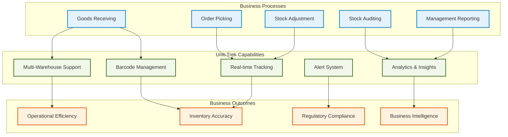

---

## 2. Container Diagrams

### 2.1 High-Level Container Architecture

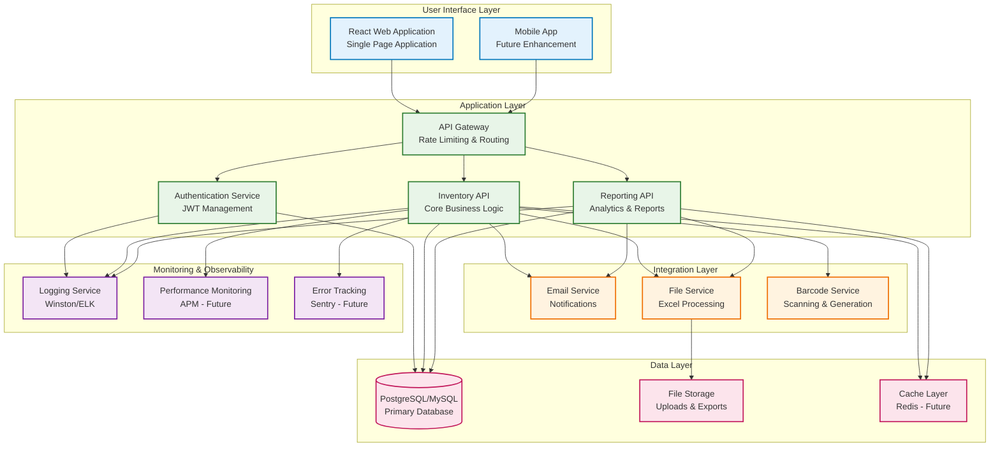

### 2.2 Detailed Container Interactions

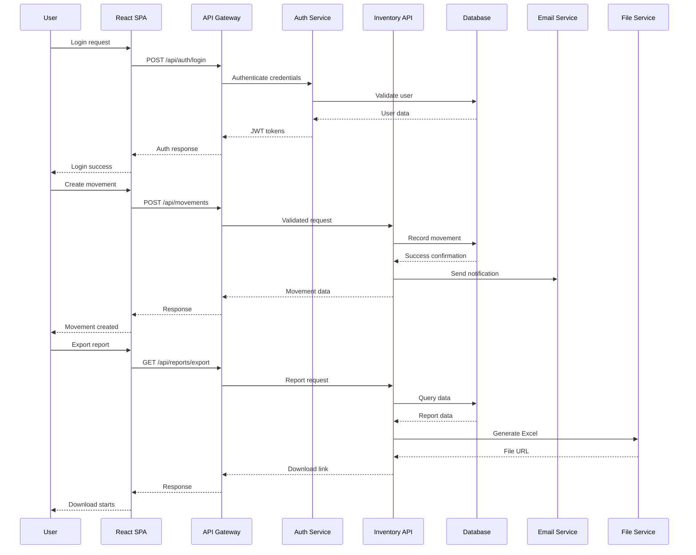

---

## 3. Component Diagrams

### 3.1 Frontend Component Architecture

```mermaid
graph TB
    subgraph "Presentation Layer"
        subgraph "Pages"
            Dashboard[Dashboard Page<br/>Analytics & KPIs]
            Inventory[Inventory Page<br/>Item Management]
            Movement[Movement Page<br/>Stock Operations]
            History[History Page<br/>Audit Trail]
            Warehouse[Warehouse Page<br/>Location Management]
            Analytics[Analytics Page<br/>Advanced Reports]
            Barcode[Barcode Tools<br/>Scanning & Gen]
        end

        subgraph "Shared Components"
            Layout[App Layout<br/>Navigation & Header]
            ThemeProvider[Theme Provider<br/>Dark/Light Mode]
            I18nProvider[Internationalization<br/>EN/AR Support]
            ErrorBoundary[Error Boundary<br/>Error Handling]
        end
    end

    subgraph "Component Library"
        subgraph "UI Components"
            Forms[Form Components<br/>Input & Validation]
            Tables[Table Components<br/>Data Display]
            Charts[Chart Components<br/>Data Visualization]
            Dialogs[Dialog Components<br/>Modals & Overlays]
            Notifications[Toast Notifications<br/>User Feedback]
        end

        subgraph "Business Components"
            ItemCard[Item Card<br/>Item Display]
            MovementForm[Movement Form<br/>Stock Operations]
            BarcodeScanner[Barcode Scanner<br/>Scanning Interface]
            SearchFilters[Search Filters<br/>Data Filtering]
            DataTable[Data Table<br/>Sortable/Paginated]
        end
    end

    subgraph "State Management"
        subgraph "Contexts"
            AuthContext[Authentication Context<br/>User Session]
            WarehouseContext[Warehouse Context<br/>Selected Warehouse]
            InventoryContext[Inventory Context<br/>Items & Movements]
            ThemeContext[Theme Context<br/>UI Theme]
            LocaleContext[Locale Context<br/>Language]
            NotificationContext[Notification Context<br/>System Messages]
        end

        subgraph "Data Layer"
            ApiClient[API Client<br/>HTTP Requests]
            QueryClient[React Query<br/>Server State]
            LocalStorage[Local Storage<br/>User Preferences]
        end
    end

    subgraph "Utilities"
        Hooks[Custom Hooks<br/>Business Logic]
        Utils[Utility Functions<br/>Helpers & Tools]
        Validators[Form Validators<br/>Input Validation]
        Formatters[Data Formatters<br/>Display Formatting]
    end

    %% Page connections
    Dashboard --> Charts
    Dashboard --> DataTable
    Inventory --> ItemCard
    Inventory --> SearchFilters
    Movement --> MovementForm
    Movement --> BarcodeScanner
    History --> DataTable
    Analytics --> Charts
    Barcode --> BarcodeScanner

    %% Layout connections
    Layout --> Dashboard
    Layout --> Inventory
    Layout --> Movement
    Layout --> History
    Layout --> Warehouse
    Layout --> Analytics
    Layout --> Barcode

    %% Theme and providers
    ThemeProvider --> Layout
    I18nProvider --> Layout
    ErrorBoundary --> Layout

    %% Component library usage
    Forms --> MovementForm
    Tables --> DataTable
    Charts --> Charts
    Dialogs --> Forms
    Notifications --> Layout

    %% State management
    AuthContext --> ApiClient
    WarehouseContext --> ApiClient
    InventoryContext --> QueryClient
    ThemeContext --> ThemeProvider
    LocaleContext --> I18nProvider
    NotificationContext --> Notifications

    %% Data layer
    ApiClient --> QueryClient
    QueryClient --> LocalStorage

    %% Utilities usage
    Hooks --> Forms
    Utils --> ItemCard
    Validators --> Forms
    Formatters --> DataTable

    %% Styling
    classDef page fill:#e3f2fd,stroke:#0277bd,stroke-width:2px
    classDef shared fill:#e8f5e8,stroke:#2e7d32,stroke-width:2px
    classDef component fill:#fff3e0,stroke:#ef6c00,stroke-width:2px
    classDef state fill:#f3e5f5,stroke:#7b1fa2,stroke-width:2px
    classDef utility fill:#fce4ec,stroke:#c2185b,stroke-width:2px

    class Dashboard,Inventory,Movement,History,Warehouse,Analytics,Barcode page
    class Layout,ThemeProvider,I18nProvider,ErrorBoundary shared
    class Forms,Tables,Charts,Dialogs,Notifications,ItemCard,MovementForm,BarcodeScanner,SearchFilters,DataTable component
    class AuthContext,WarehouseContext,InventoryContext,ThemeContext,LocaleContext,NotificationContext,ApiClient,QueryClient,LocalStorage state
    class Hooks,Utils,Validators,Formatters utility
```

### 3.2 Backend Component Architecture

```mermaid
graph TB
    subgraph "API Layer"
        subgraph "Route Handlers"
            AuthRoutes[Auth Routes<br/>/api/auth/*]
            UserRoutes[User Routes<br/>/api/users/*]
            WarehouseRoutes[Warehouse Routes<br/>/api/warehouses/*]
            ItemRoutes[Item Routes<br/>/api/items/*]
            MovementRoutes[Movement Routes<br/>/api/movements/*]
            HistoryRoutes[History Routes<br/>/api/history/*]
            UnitRoutes[Unit Routes<br/>/api/units/*]
        end

        subgraph "Middleware"
            AuthMiddleware[JWT Authentication<br/>Token Validation]
            ValidationMiddleware[Request Validation<br/>Zod Schemas]
            ErrorMiddleware[Error Handling<br/>Graceful Responses]
            RateLimitMiddleware[Rate Limiting<br/>Abuse Prevention]
            CorsMiddleware[CORS Handling<br/>Cross-Origin Requests]
            LoggingMiddleware[Request Logging<br/>Audit Trail]
        end
    end

    subgraph "Business Logic Layer"
        subgraph "Services"
            AuthService[Auth Service<br/>User Management]
            UserService[User Service<br/>Profile Management]
            WarehouseService[Warehouse Service<br/>Location Management]
            ItemService[Item Service<br/>Inventory Management]
            MovementService[Movement Service<br/>Stock Operations]
            HistoryService[History Service<br/>Audit Management]
            UnitService[Unit Service<br/>Measurement Units]
            EmailService[Email Service<br/>Notifications]
        end

        subgraph "Business Rules"
            ValidationRules[Validation Rules<br/>Business Logic]
            PermissionRules[Permission Rules<br/>Access Control]
            NotificationRules[Notification Rules<br/>Alert Logic]
            AuditRules[Audit Rules<br/>Logging Rules]
        end
    end

    subgraph "Data Access Layer"
        subgraph "Database Components"
            DatabaseAdapter[Database Adapter<br/>Multi-DB Support]
            ConnectionPool[Connection Pool<br/>DB Connections]
            TransactionManager[Transaction Manager<br/>ACID Operations]
            MigrationEngine[Migration Engine<br/>Schema Management]
        end

        subgraph "Models & Schemas"
            UserModel[User Model<br/>profiles table]
            WarehouseModel[Warehouse Model<br/>warehouses table]
            ItemModel[Item Model<br/>items table]
            MovementModel[Movement Model<br/>history_entries table]
            UnitModel[Unit Model<br/>units table]
        end
    end

    subgraph "Infrastructure"
        subgraph "Security"
            JWTManager[JWT Manager<br/>Token Operations]
            PasswordHasher[Password Hasher<br/>bcrypt]
            InputSanitizer[Input Sanitizer<br/>XSS Prevention]
            RateLimitStore[Rate Limit Store<br/>Memory Store]
        end

        subgraph "Monitoring"
            Logger[Winston Logger<br/>Structured Logs]
            MetricsCollector[Metrics Collector<br/>Performance Data]
            HealthChecker[Health Checker<br/>System Status]
        end

        subgraph "Utilities"
            ErrorHandler[Error Handler<br/>Centralized Errors]
            ResponseFormatter[Response Formatter<br/>Standard Responses]
            DateHelper[Date Helper<br/>Date Operations]
            Validator[Validator<br/>Input Validation]
        end
    end

    %% Route to middleware flow
    AuthRoutes --> AuthMiddleware
    UserRoutes --> AuthMiddleware
    WarehouseRoutes --> AuthMiddleware
    ItemRoutes --> AuthMiddleware
    MovementRoutes --> AuthMiddleware
    HistoryRoutes --> AuthMiddleware
    UnitRoutes --> AuthMiddleware

    %% Middleware chain
    AuthMiddleware --> ValidationMiddleware
    ValidationMiddleware --> RateLimitMiddleware
    RateLimitMiddleware --> LoggingMiddleware
    LoggingMiddleware --> ErrorMiddleware

    %% Routes to services
    AuthRoutes --> AuthService
    UserRoutes --> UserService
    WarehouseRoutes --> WarehouseService
    ItemRoutes --> ItemService
    MovementRoutes --> MovementService
    HistoryRoutes --> HistoryService
    UnitRoutes --> UnitService

    %% Services to business rules
    AuthService --> ValidationRules
    UserService --> PermissionRules
    MovementService --> NotificationRules
    HistoryService --> AuditRules

    %% Services to data access
    AuthService --> DatabaseAdapter
    UserService --> DatabaseAdapter
    WarehouseService --> DatabaseAdapter
    ItemService --> DatabaseAdapter
    MovementService --> DatabaseAdapter
    HistoryService --> DatabaseAdapter
    UnitService --> DatabaseAdapter

    %% Database adapter components
    DatabaseAdapter --> ConnectionPool
    DatabaseAdapter --> TransactionManager
    DatabaseAdapter --> MigrationEngine

    %% Models
    DatabaseAdapter --> UserModel
    DatabaseAdapter --> WarehouseModel
    DatabaseAdapter --> ItemModel
    DatabaseAdapter --> MovementModel
    DatabaseAdapter --> UnitModel

    %% Infrastructure dependencies
    AuthMiddleware --> JWTManager
    AuthService --> PasswordHasher
    ValidationMiddleware --> InputSanitizer
    RateLimitMiddleware --> RateLimitStore

    ErrorMiddleware --> Logger
    UserService --> MetricsCollector
    DatabaseAdapter --> HealthChecker

    %% Utility usage
    ErrorMiddleware --> ErrorHandler
    ErrorMiddleware --> ResponseFormatter
    MovementService --> DateHelper
    ValidationMiddleware --> Validator

    %% Email integration
    MovementService --> EmailService
    AuthService --> EmailService

    %% Styling
    classDef route fill:#e3f2fd,stroke:#0277bd,stroke-width:2px
    classDef middleware fill:#e8f5e8,stroke:#2e7d32,stroke-width:2px
    classDef service fill:#fff3e0,stroke:#ef6c00,stroke-width:2px
    classDef data fill:#f3e5f5,stroke:#7b1fa2,stroke-width:2px
    classDef infra fill:#fce4ec,stroke:#c2185b,stroke-width:2px

    class AuthRoutes,UserRoutes,WarehouseRoutes,ItemRoutes,MovementRoutes,HistoryRoutes,UnitRoutes route
    class AuthMiddleware,ValidationMiddleware,ErrorMiddleware,RateLimitMiddleware,CorsMiddleware,LoggingMiddleware middleware
    class AuthService,UserService,WarehouseService,ItemService,MovementService,HistoryService,UnitService,EmailService service
    class DatabaseAdapter,ConnectionPool,TransactionManager,MigrationEngine,UserModel,WarehouseModel,ItemModel,MovementModel,UnitModel data
    class JWTManager,PasswordHasher,InputSanitizer,RateLimitStore,Logger,MetricsCollector,HealthChecker,ErrorHandler,ResponseFormatter,DateHelper,Validator infra
```

---

## 4. Sequence Diagrams

### 4.1 User Authentication Flow

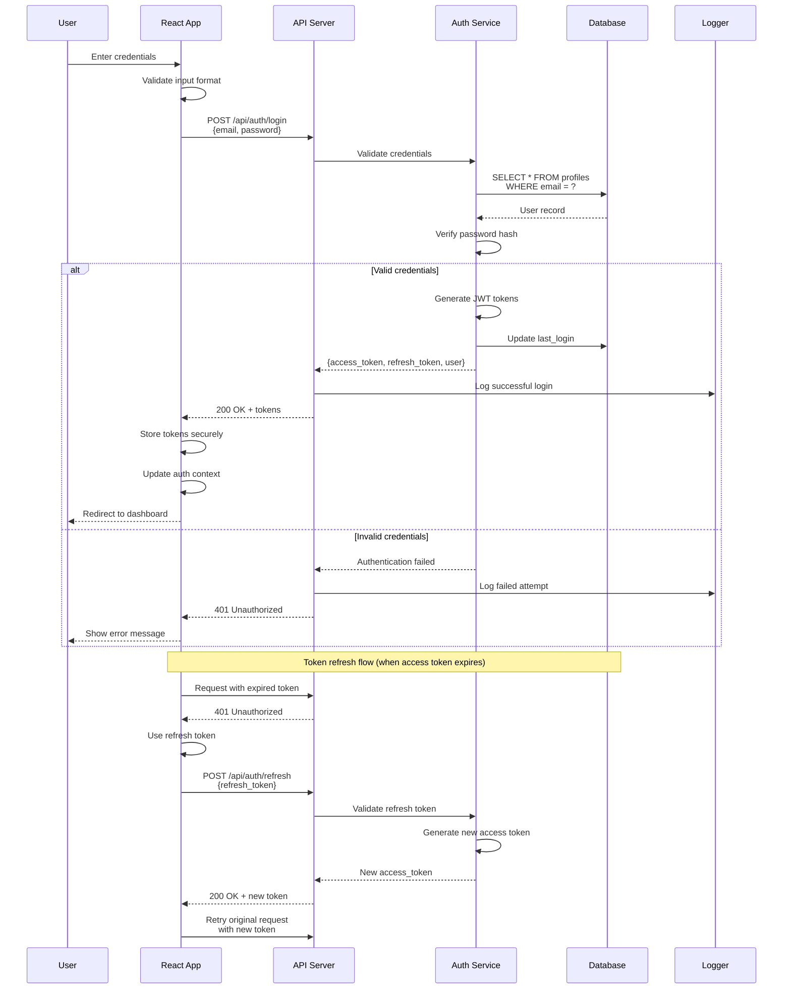

### 4.2 Inventory Movement Flow

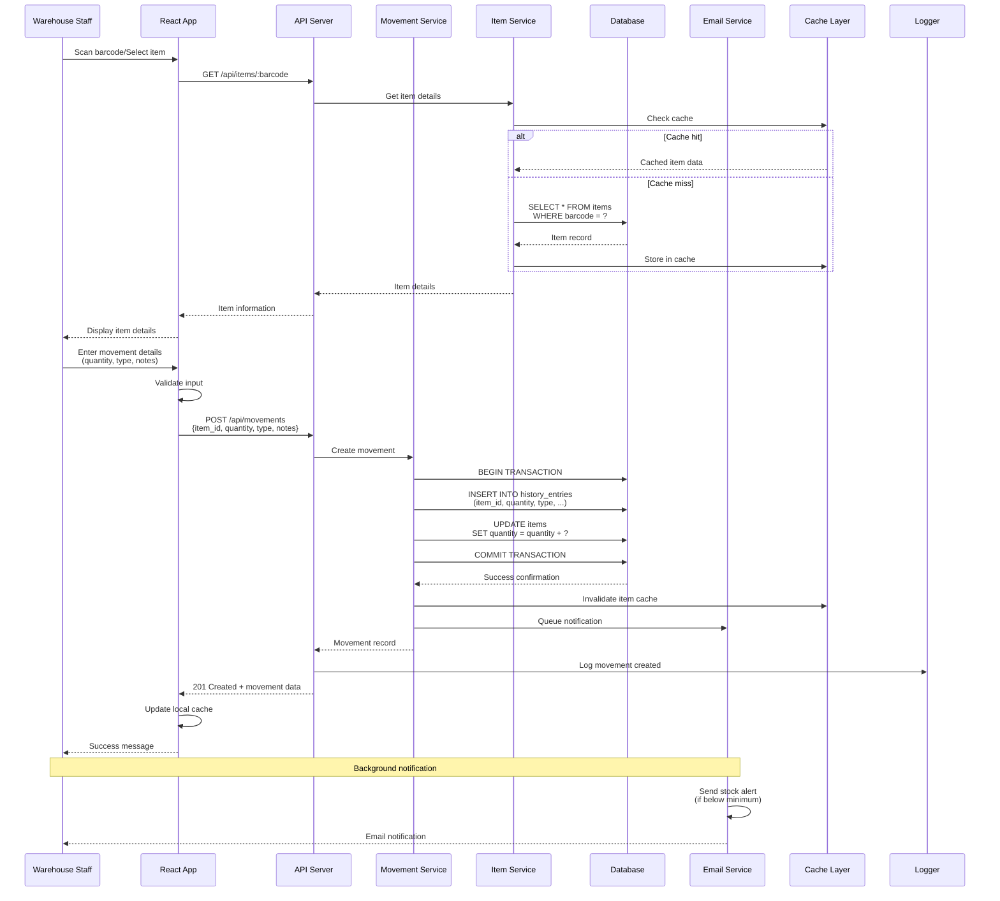

### 4.3 Data Export Flow

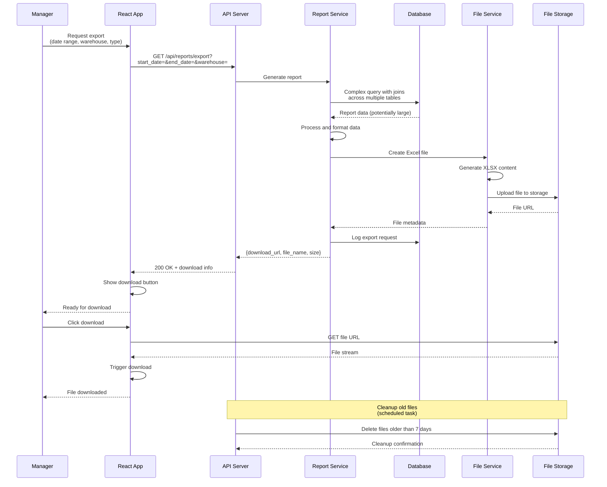

---

## 5. Data Flow Diagrams

### 5.1 Master Data Management Flow

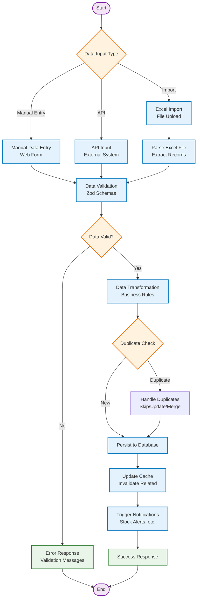

### 5.2 Real-time Data Synchronization Flow

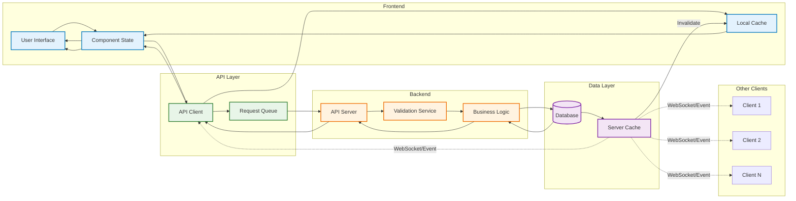

### 5.3 Error Handling and Recovery Flow

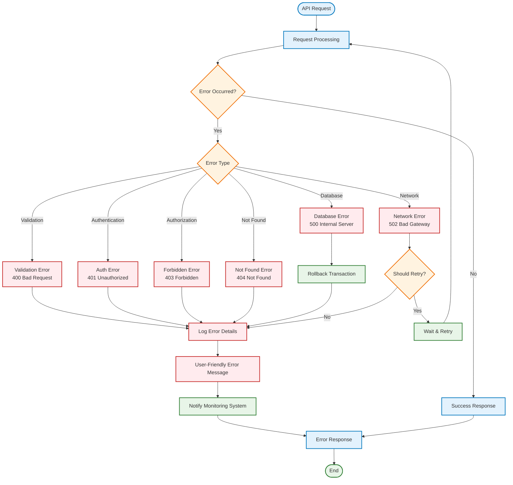

---

## 6. Deployment Diagrams

### 6.1 Development Environment Architecture

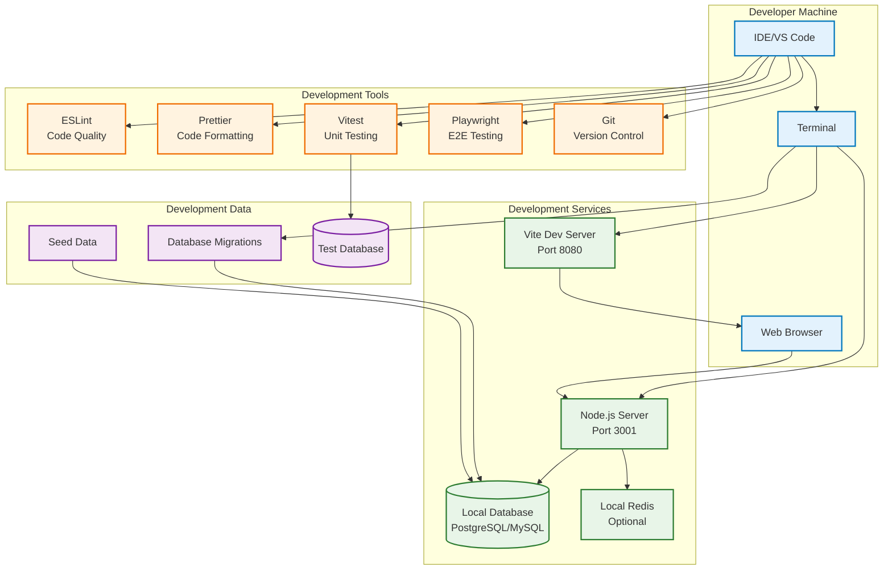

### 6.2 Production Deployment Architecture

```mermaid
graph TB
    subgraph "Internet"
        Users[End Users]
        Internet[Internet]
    end

    subgraph "CDN & Static Assets"
        CDN[CDN (Cloudflare/AWS CloudFront)<br/>Frontend Assets]
        S3[S3 Storage<br/>Static Files]
    end

    subgraph "Load Balancing"
        LB[Load Balancer (NGINX/HAProxy)<br/>SSL Termination]
    end

    subgraph "Application Servers"
        API1[API Server 1<br/>Node.js + PM2]
        API2[API Server 2<br/>Node.js + PM2]
        API3[API Server N<br/>Node.js + PM2]
    end

    subgraph "Database Layer"
        Master[(Master Database<br/>PostgreSQL)]
        Replica1[(Read Replica 1<br/>PostgreSQL)]
        Replica2[(Read Replica N<br/>PostgreSQL)]
        Redis[(Redis Cache<br/>Session & Query Cache)]
    end

    subgraph "File Storage"
        FileStorage[File Storage<br/>AWS S3/MinIO]
    end

    subgraph "Monitoring & Logging"
        ELK[ELK Stack<br/>Logging]
        Prometheus[Prometheus<br/>Metrics]
        Grafana[Grafana<br/>Dashboards]
        Sentry[Sentry<br/>Error Tracking]
    end

    subgraph "External Services"
        EmailProvider[Email Service<br/>SendGrid/SES]
        BackupService[Backup Service<br/>Automated Backups]
    end

    %% User flow
    Users --> Internet
    Internet --> CDN
    Internet --> LB

    %% Static assets
    CDN --> S3

    %% Load balancing
    LB --> API1
    LB --> API2
    LB --> API3

    %% Database connections
    API1 --> Master
    API2 --> Master
    API3 --> Master

    API1 --> Replica1
    API2 --> Replica1
    API3 --> Replica2

    %% Cache layer
    API1 --> Redis
    API2 --> Redis
    API3 --> Redis

    %% File storage
    API1 --> FileStorage
    API2 --> FileStorage
    API3 --> FileStorage

    %% Monitoring
    API1 --> ELK
    API2 --> ELK
    API3 --> ELK

    API1 --> Prometheus
    API2 --> Prometheus
    API3 --> Prometheus

    Prometheus --> Grafana
    ELK --> Grafana

    API1 --> Sentry
    API2 --> Sentry
    API3 --> Sentry

    %% External services
    API1 --> EmailProvider
    API2 --> EmailProvider
    API3 --> EmailProvider

    Master --> BackupService

    %% Styling
    classDef user fill:#e3f2fd,stroke:#0277bd,stroke-width:2px
    classDef static fill:#e8f5e8,stroke:#2e7d32,stroke-width:2px
    classDef loadbalancer fill:#fff3e0,stroke:#ef6c00,stroke-width:2px
    classDef server fill:#f3e5f5,stroke:#7b1fa2,stroke-width:2px
    classDef data fill:#fce4ec,stroke:#c2185b,stroke-width:2px
    classDef monitoring fill:#e1f5fe,stroke:#0277bd,stroke-width:2px
    classDef external fill:#f1f8e9,stroke:#33691e,stroke-width:2px

    class Users,Internet user
    class CDN,S3 static
    class LB loadbalancer
    class API1,API2,API3 server
    class Master,Replica1,Replica2,Redis,FileStorage data
    class ELK,Prometheus,Grafana,Sentry monitoring
    class EmailProvider,BackupService external
```

### 6.3 Microservices Evolution Architecture

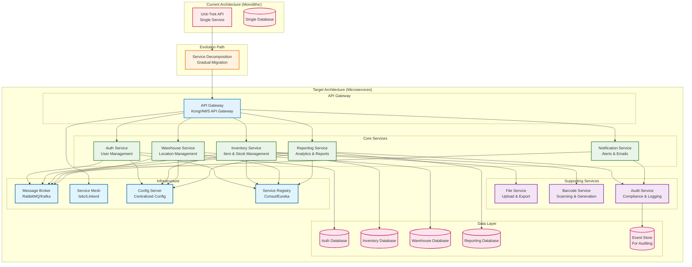

---

## Conclusion

These diagrams provide a comprehensive visual representation of the Unit-Trek Inventory Management System architecture at various levels of abstraction:

1. **Context Diagrams** show the system's relationship with users and external systems
2. **Container Diagrams** illustrate the high-level technology choices and interactions
3. **Component Diagrams** detail the internal structure of frontend and backend applications
4. **Sequence Diagrams** demonstrate the flow of interactions for key processes
5. **Data Flow Diagrams** visualize how data moves through the system
6. **Deployment Diagrams** show how the system is deployed in different environments

These diagrams serve as living documentation that should be updated as the system evolves and new features are added.